# 04 — System Architecture

## 1. Document Control

*   **Document Title:** System Architecture
*   **File:** `docs/04-SYSTEM-ARCHITECTURE.md`
*   **Project:** AI Powered Decentralized Public Fund Tracking and Fraud Detection Platform
*   **Version:** 1.0.3
*   **Status:** APPROVED
*   **Author:** AI Engineering Agent
*   **Date:** 2026-09-28
*   **Source Baselines:**
    *   `docs/00-PROJECT-DEFINITION.md` (v0.3.0, BASELINE APPROVED)
    *   `docs/01-PRD.md` (v1.1.0, APPROVED)
    *   `docs/02-FRD.md` (v1.0.1, APPROVED)
    *   `docs/03-TRD.md` (v1.0.1, APPROVED)

## 2. Architecture Purpose and Scope

This document translates the approved product, functional, and technical requirements into a coherent logical and physical architecture. It defines system components, their boundaries, interactions, and responsibilities.

**Intentionally Out of Scope:**
*   Detailed UI/UX designs
*   Detailed AI/ML hyperparameters and training math
*   Implementation sequencing and planning
*   Production infrastructure (cloud, k8s, microservices, load balancers)

## 3. Architecture Principles

The architecture adheres to the following core principles established in the baselines:
*   **Hybrid Architecture:** Segregation of operational data and immutable audit records.
*   **PostgreSQL as Operational Layer:** Handles complex queries, relationships, and rapid access.
*   **Blockchain as Audit Layer:** A tamper-evident ledger for lifecycle events, providing transparency.
*   **IPFS for Off-Chain Evidence:** Immutable distributed storage for documents, referenced on-chain and in PostgreSQL.
*   **AI as Human-in-the-Loop:** AI identifies anomalies and flags risks but does not autonomously block funds or label fraud.
*   **JWT and Wallet Separation:** Application access (JWT) is separated from blockchain transaction authorization (Wallet).
*   **Server as Orchestration Layer:** The Server orchestrates business logic and interacts with Blockchain and IPFS.
*   **Academic Prototype Boundary:** Architecture is constrained to a local, single-process Server model with Hardhat, prioritizing core logic over distributed scaling.

## 4. System Context

The system interacts with six distinct actors:

*   **Platform Admin:** Manages system-level configurations and user roles.
*   **Government Admin:** Oversees platform activities, creates projects, allocates budgets, approves or rejects fund releases, escalates issues to Auditors, and marks projects as completed.
*   **Department Officer / Engineer:** Performs the explicit verification step for milestones (Officer verification) and manages physical progress workflows.
*   **Contractor:** Executes project work, provides/updates relevant physical progress information, and submits fund release requests.
*   **Auditor:** Independently investigates AI-flagged anomalies or manual escalations and records authoritative findings.
*   **Citizen:** Accesses public transparency dashboards to view immutable, approved public funding and project data.

## 5. High-Level System Architecture

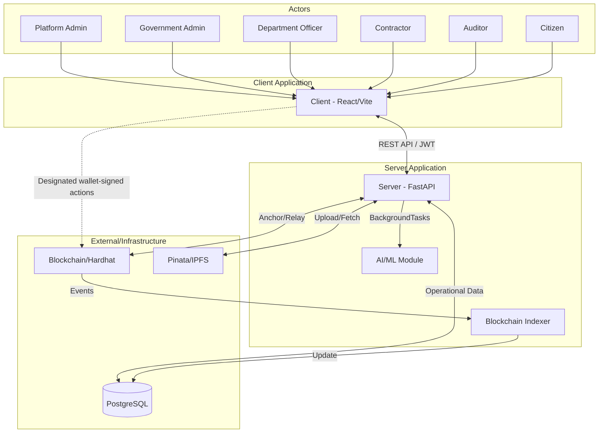

*Note: The Blockchain Indexer is an in-process component within the single Server.*

## 6. Architectural Components

*   **Client:** React + Vite SPA. Handles UI, role-based dashboards, and browser wallet integration (MetaMask) for designated wallet-signed actions (exclusively for Contractors and Auditors during specific workflows).
*   **Server:** Python + FastAPI single-process application. Contains all business logic, orchestrates data flow, acts as the Blockchain relayer for system and administrative actions, and serves the REST API.
*   **PostgreSQL:** Relational database storing user data, project metadata, caching indexed blockchain state, storing IPFS CIDs, and providing rich query capabilities.
*   **Smart Contract:** Solidity code executing on the blockchain. Maintains minimal state (e.g., entity IDs and hashes) and emits events for lifecycle milestones.
*   **Blockchain:** Local Hardhat network acting as the tamper-evident audit and lifecycle anchoring layer.
*   **Blockchain Indexer:** An in-process component within the Server that periodically polls the blockchain, decodes relevant events, and synchronizes applicable blockchain records into PostgreSQL.
*   **IPFS/Pinata:** Decentralized storage for supporting evidence. Uploads are managed by the Server to Pinata, returning a CID.
*   **AI/ML Module:** In-process Python component inside the Server (scikit-learn Isolation Forest + rule-based) analyzing project data for anomalies.
*   **Deadline Scheduler:** APScheduler instance within the Server checking for overdue milestones.
*   **Notification Service:** Internal module for writing in-app notifications to PostgreSQL and exposing them via API.
*   **Browser Wallet:** User's local Ethereum wallet extension used exclusively for signing designated actions (Contractor fund release requests, Auditor audit findings).

## 7. Client Architecture

The Client relies on a modular component hierarchy.

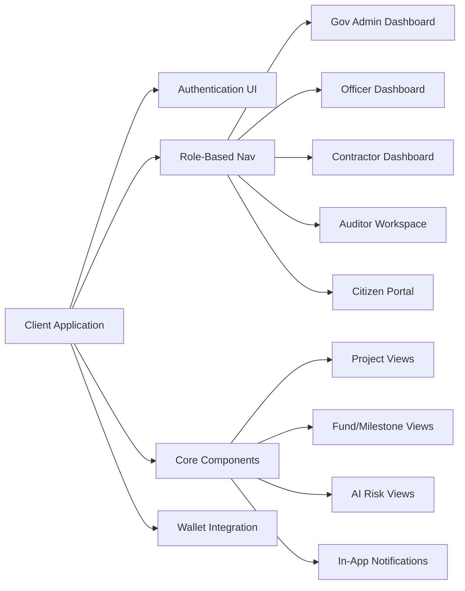

## 8. Server Architecture

The Server is a single-process FastAPI application logically partitioned into domains. All modules below are internal components of this single Server.

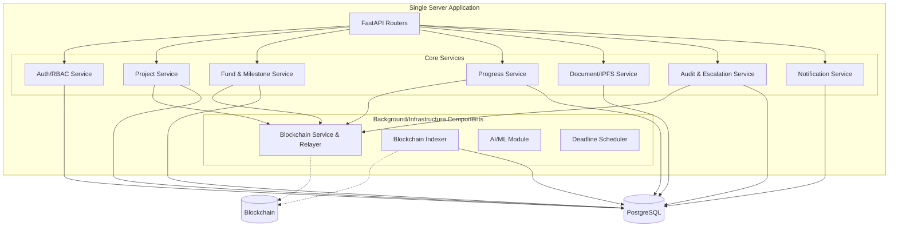

## 9. Data Architecture

The platform uses three distinct persistence layers:

1.  **PostgreSQL (Operational Data):** Authoritative operational/queryable database for user accounts, active/inactive statuses, roles, rich relational mapping of projects to milestones, CIDs, and notifications.
2.  **Blockchain (Audit Ledger):** Blockchain maintains only the minimal persistent on-chain state required for entity mappings, current-state validation, and contract constraints. Lifecycle/audit history is primarily represented through approved Solidity events. PostgreSQL remains the operational/queryable application database. Blockchain is NOT a mirror of PostgreSQL.
3.  **IPFS (Evidence Storage):** Large documents remain off-chain in IPFS. CIDs are generated via the Server, saved in PostgreSQL, and anchored in relevant blockchain events.

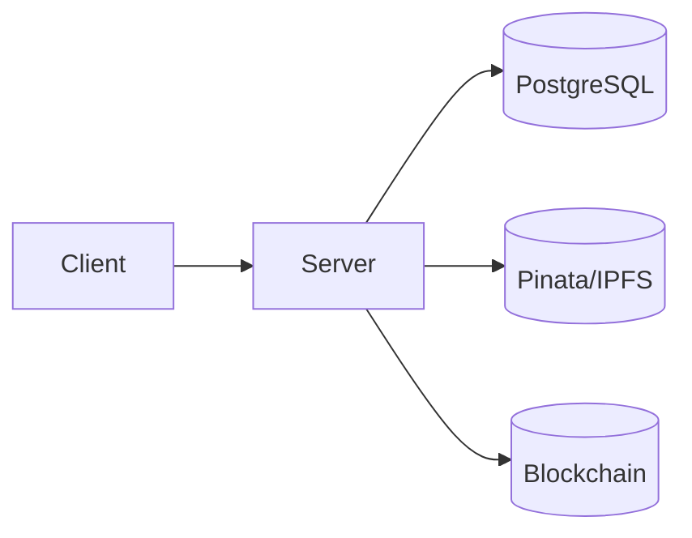

## 10. Identifier and Entity Mapping Architecture

Application identity (UUID) is separated from blockchain identity (`uint256`).

*   `projectId`: PostgreSQL UUID → `on_chain_id`
*   `milestoneId`: PostgreSQL UUID → `on_chain_id`
*   `releaseId`: PostgreSQL UUID → `on_chain_id`

**AI and Audit Mapping:**
*   `flagId`: PostgreSQL UUID → `on_chain_id` (Identifies an AI-generated risk anomaly)
*   `findingId`: PostgreSQL UUID → `on_chain_id` (Identifies a human Auditor's manual finding)
*   `escalationId`: PostgreSQL UUID (Identifies a Government Admin manual escalation to an Auditor, not directly mapped on-chain until an audit finding is created)

If an Audit Finding originates from a Government Admin escalation rather than an AI flag, the `flagId` stored on-chain during the `AuditFindingRecorded` event is `0`.

## 11. Blockchain Architecture

*   **Network:** Local Hardhat.
*   **State:** Blockchain maintains only the minimal persistent on-chain state required for entity mappings, current-state validation, and contract constraints.
*   **Events (Approved Baseline):**
    *   `ProjectCreated`
    *   `BudgetAllocated`
    *   `MilestoneDefined`
    *   `FundReleaseRequested`
    *   `OfficerVerified`
    *   `FundReleaseApproved`
    *   `FundReleaseRejected`
    *   `AIAnomalyRecorded`
    *   `AuditFindingRecorded`
    *   `ProjectCompleted`

## 12. Blockchain Event Indexing Architecture

Because blockchain state cannot be queried relationally, the Server indexes events back into PostgreSQL using an in-process Blockchain Indexer.

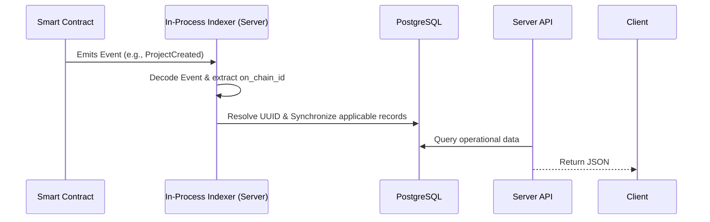

## 13. IPFS Evidence Architecture

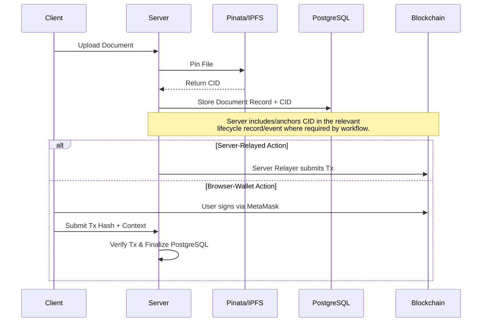

## 14. AI/ML Architecture

The AI module executes asynchronously as a downstream processor via FastAPI BackgroundTasks inside the single Server. It does not block originating operations.

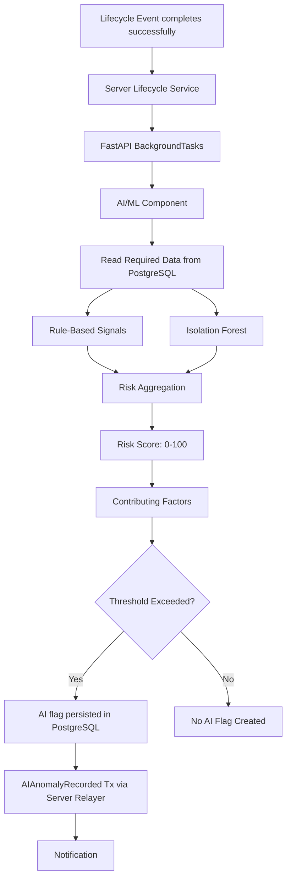

**Capabilities:**
1. Financial utilization vs physical progress mismatch.
2. Budget overrun risk/trajectory.
3. Project delay risk.
4. Duplicate/near-duplicate invoice detection.
5. Unusual spending patterns (Isolation Forest).

*Note: AI analysis does NOT determine fraud, corruption, or legal wrongdoing. It generates anomalies for Auditor investigation.*

## 15. Authentication and Authorization Architecture

JWT and Wallet authentication are distinct mechanisms.

1.  **JWT Application Auth:** Protects operational REST endpoints. Role changes and account deactivation take effect immediately because the Server checks current PostgreSQL status/role on protected requests. No JWT blacklists are used.
2.  **Wallet Signatures:** Required only for designated browser-wallet actions (Contractor fund release requests, Auditor findings). The Server verifies the blockchain transaction context and registered wallet address before finalizing application state.

Public citizen endpoints are read-only and publicly accessible without JWT.

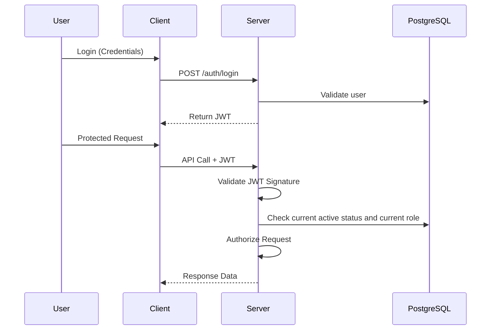

## 16. Notification Architecture

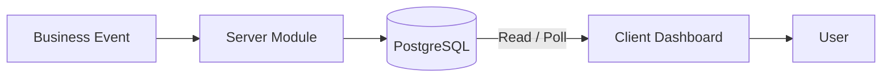

## 17. Scheduled Deadline Detection

Deadline detection is a periodic deterministic Server-side check. AI does not decide if a milestone is overdue.

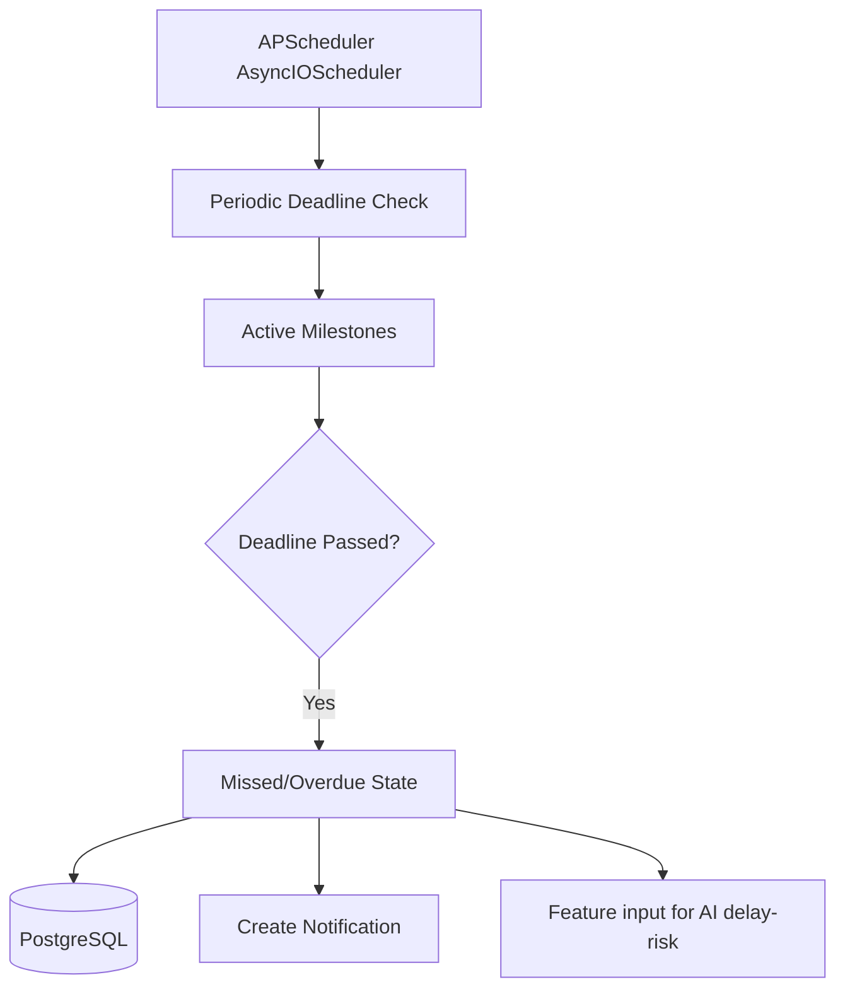

## 18. Core Sequence Diagrams

### 18.1 Authentication
*(Refer to Section 15 for expanded diagram)*

### 18.2 Project Creation (Server Relayed)
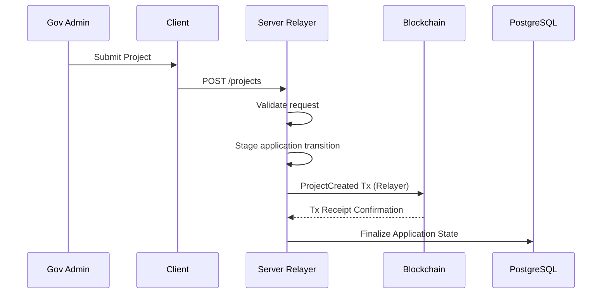

### 18.3 Contractor Fund Release Request (Browser Wallet)
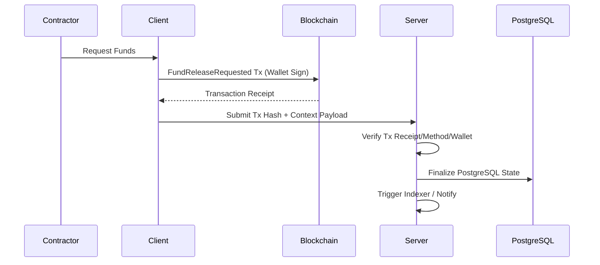

### 18.4 Officer Verification (Server Relayed)
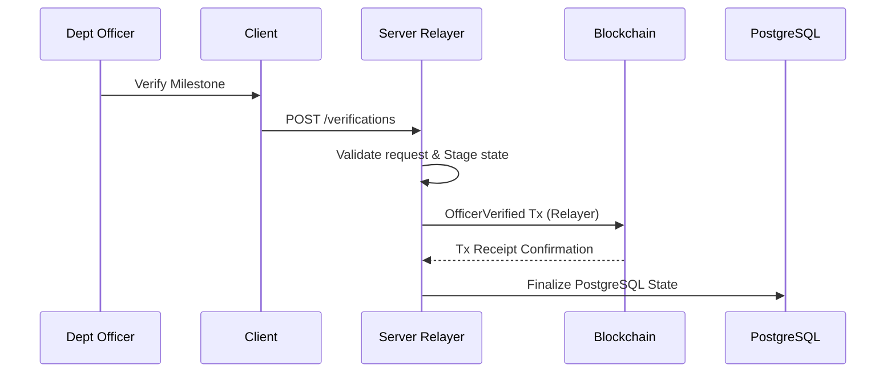

### 18.5 Government Admin Fund Release Approval (Server Relayed)
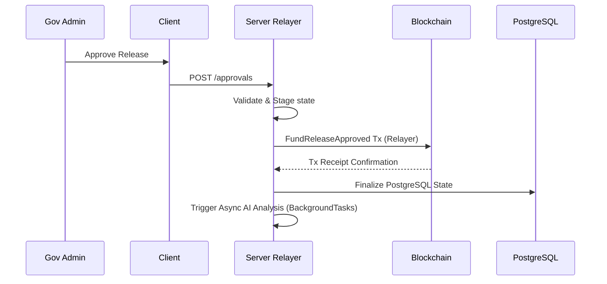

### 18.6 AI Analysis (Server Relayed)
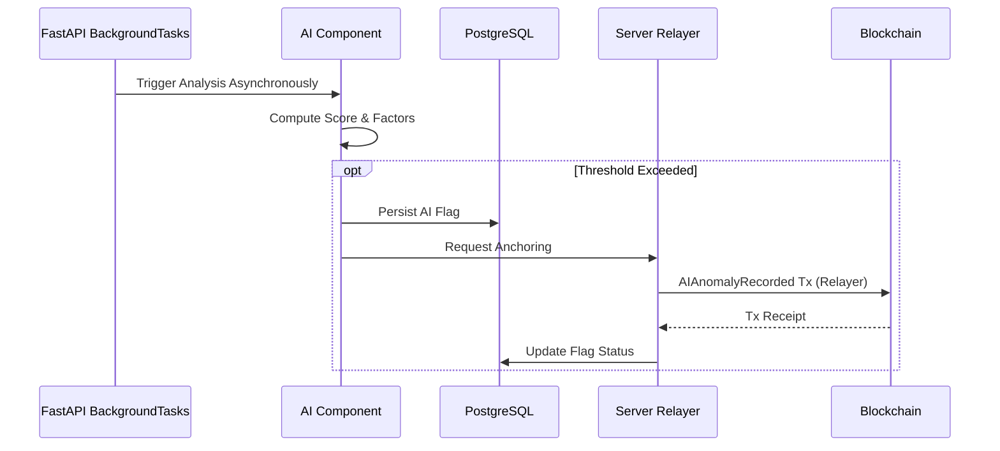

### 18.7 Document Upload / IPFS
*(Refer to Section 13 for diagram)*

### 18.8 Auditor Investigation
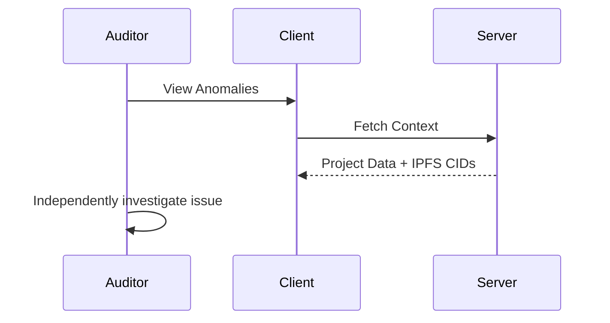

### 18.9 Government Admin → Auditor Escalation
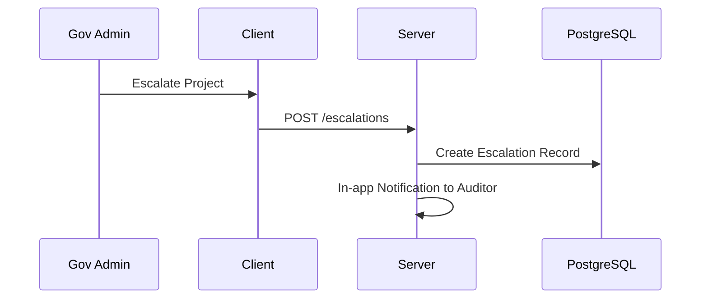

### 18.10 Auditor Records Audit Finding (Browser Wallet)
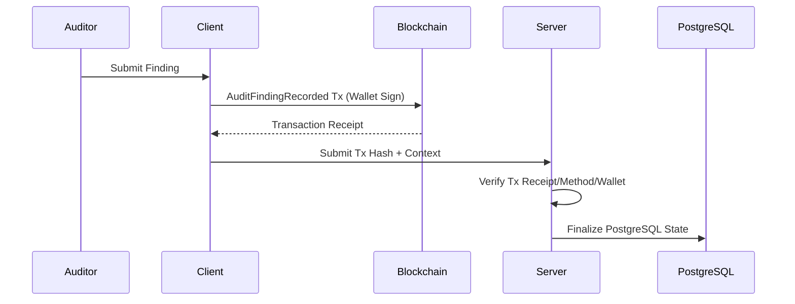

### 18.11 Project Completion (Server Relayed)
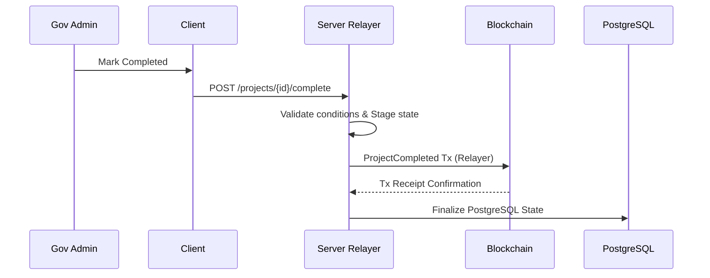

### 18.12 Citizen Public Transparency View
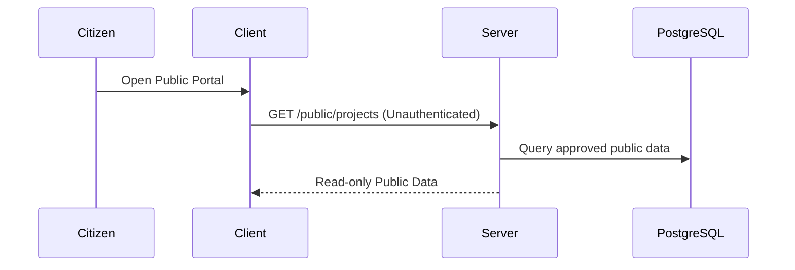

### 18.13 Blockchain Event Indexing
*(Refer to Section 12 for diagram)*

### 18.14 Blockchain Failure / Recovery (Relayed Action)
```mermaid
sequenceDiagram
    participant C as Client
    participant S as Server Relayer
    participant BC as Blockchain
    participant DB as PostgreSQL
    
    C->>S: Action Request
    S->>S: Stage application transition
    S->>BC: Submit Tx
    BC-->>S: Revert / Timeout / Failure
    S->>DB: Rollback staged transition
    S->>S: Log diagnostic information
    S-->>C: Return Descriptive Error
```

## 19. End-to-End Fund Lifecycle

The business lifecycle proceeds through distinct stages, with the Blockchain acting as a cross-cutting audit and anchoring layer.

```mermaid
flowchart TD
    subgraph Business Lifecycle
        A[Project Creation] --> B[Budget Allocation]
        B --> C[Milestone Definition]
        C --> D[Fund Release Request]
        D --> E[Officer Verification]
        E --> F[Fund Release Approval]
        F --> G[Async AI Analysis]
        G -.-> H[Auditor Investigation when applicable]
        H -.-> I[Audit Finding when applicable]
        F --> J[Project Completion]
        J --> K[Citizen Transparency]
    end
    
    subgraph Audit/Anchoring Layer
        BC[(Blockchain)]
    end
    
    A -.-> BC
    B -.-> BC
    C -.-> BC
    D -.-> BC
    E -.-> BC
    F -.-> BC
    G -.->|If Anomaly Found| BC
    I -.-> BC
    J -.-> BC
```

## 20. Network and Port Topology

The academic prototype uses local ports:
*   **Client (React/Vite):** `5173`
*   **Server (FastAPI):** `8000`
*   **PostgreSQL:** `5432`
*   **Blockchain (Hardhat):** `8545`

*Pinata/IPFS is accessed externally via HTTPS.*

## 21. Local Deployment Architecture

```mermaid
flowchart LR
    subgraph Developer Machine
        C[Client :5173]
        S[Server :8000]
        DB[(PostgreSQL :5432)]
        BC[(Hardhat :8545)]
    end
    
    subgraph External
        IPFS[Pinata API]
    end
    
    C --> S
    S --> DB
    S --> BC
    S --> IPFS
    C -.->|Designated wallet-signed actions| BC
```

## 22. Process and Execution Model

The Server execution model is explicitly divided into the following internal components:

*   **A. REST/API and Business Logic:** Core FastAPI application handling synchronous HTTP requests.
*   **B. Blockchain Relayer:** In-process Server component that submits approved administrative/system transactions to Hardhat.
*   **C. Blockchain Indexer:** In-process Server component that periodically polls blockchain events, decodes them, and synchronizes applicable records into PostgreSQL.
*   **D. AI/ML Execution:** Uses FastAPI `BackgroundTasks` for asynchronous, non-durable processing following successful lifecycle events.
*   **E. Deadline Detection:** Uses APScheduler `AsyncIOScheduler` for periodic deterministic Server-side checks.

*External Processes:*
*   **Client Browser:** Single-page application logic and MetaMask injection.
*   **Database:** Standard PostgreSQL daemon.
*   **Blockchain:** Local Node.js process for Hardhat.

## 23. Data Consistency Architecture

Data consistency follows a staged, eventual-consistency model managed by the Server. PostgreSQL and Blockchain are NOT committed via literal distributed atomic transactions.

**Server-Relayed Operations:**
1.  **Validate:** Server checks rules and RBAC.
2.  **Stage:** Application transition staged in PostgreSQL.
3.  **Submit:** Server Relayer submits Blockchain Tx.
4.  **Confirm:** Wait for transaction receipt.
5.  **Finalize:** On success, application state is finalized, and indexed. On failure, staged transition is rolled back, and an error is returned.

**Browser-Wallet Operations:**
1.  **Sign & Broadcast:** User signs Tx via MetaMask, Blockchain confirms it.
2.  **Submit Context:** Client submits Tx hash and context to Server.
3.  **Verify:** Server validates the Tx receipt, method, parameters, and authorized wallet address.
4.  **Finalize:** Server finalizes the corresponding PostgreSQL state upon successful verification.

## 24. Failure and Recovery Boundaries

*   **PostgreSQL Unavailable:** System halts (read/write impossible); dependent operations fail.
*   **Blockchain Tx Failure (Relayer):** Staged transition is rolled back, error returned. Action is not presented as successful.
*   **Blockchain Tx Verification Failure (Wallet):** Submitted context is rejected, application state is not finalized.
*   **Indexer Interruption:** Indexer resumes from the appropriate known block/event position upon restart.
*   **IPFS Upload Failure:** Document-dependent action is rejected. Must retry upload to proceed.
*   **AI Analysis Failure:** Originating lifecycle operation remains successful. Failure is caught and logged. No durable retry mechanism is provided.
*   **Notification Failure:** Logged, non-blocking to the underlying business operation.

## 25. Security Boundaries

*   **JWT:** Guards operational REST API endpoints. Enforces RBAC by verifying current status and role from PostgreSQL dynamically.
*   **Role Separation:** Hardcoded checks ensure Officers cannot approve funds, Contractors cannot verify their own work.
*   **Wallet Signing:** Critical actions (Contractor requests, Auditor findings) require cryptographic signatures from registered addresses verified by the Server.
*   **Server Relayer Private Key:** Retained securely on the Server; never exposed to the Client.
*   **File Upload Validation:** Server checks file sizes/types before Pinata upload.
*   **Audit Trail:** Blockchain events cannot be altered by modifying PostgreSQL.
*   **Encryption Limitation:** IPFS evidence documents are NOT encrypted in the current academic baseline.
*   **Public Access:** Citizen endpoints are read-only, selectively exposing approved public data without exposing sensitive workflows.

## 26. Architecture Traceability

| Architecture Area | Source |
| :--- | :--- |
| Client/Server separation | TRD |
| PostgreSQL | PRD / FRD / TRD |
| Blockchain audit layer | PRD / FRD / TRD |
| IPFS evidence | PRD / FRD / TRD |
| AI/ML | PRD / FRD / TRD |
| Human auditor workflow | PRD / FRD |
| Deadline scheduler | FRD / TRD |
| Citizen portal | PRD / FRD |
| Hybrid wallet signing | TRD |
| Blockchain indexing | TRD |

## 27. Architecture Decisions and Assumptions

*   **DECISION:** Hybrid data model (PostgreSQL for ops, Blockchain for audit) to balance speed and immutability.
*   **DECISION:** AI logic runs in-process to avoid microservice complexity in an academic prototype.
*   **DECISION:** Distinguish `findingId` from `flagId` for tracking manual vs AI anomalies.
*   **DECISION:** Hybrid transaction signing (Wallet for Contractor/Auditor; Relayer for Admin/Officer/System).
*   **DECISION:** Local Hardhat as the primary blockchain environment.
*   **DECISION:** FastAPI BackgroundTasks for AI execution (non-durable).
*   **DECISION:** APScheduler for deadline detection logic.
*   **ASSUMPTION:** Network latency to Pinata is acceptable for blocking uploads without an asynchronous queue.

## 28. Deferred Architecture Items

*   Detailed UI/UX component library structure → **UI/UX Design**
*   Detailed AI/ML algorithms, data schemas, math → **AI/ML Design**
*   Step-by-step implementation build order → **Implementation Plan**

## 29. Architecture Review Checklist

*   [x] Client/Server terminology is correct
*   [x] No microservices introduced
*   [x] PostgreSQL remains operational data layer
*   [x] Blockchain remains audit layer
*   [x] IPFS remains evidence layer
*   [x] AI remains human-in-the-loop
*   [x] JWT and Wallet are separate
*   [x] Blockchain indexer is represented
*   [x] Hybrid signing is represented correctly
*   [x] All major workflows have sequence diagrams
*   [x] Local deployment topology is documented
*   [x] No production-scale infrastructure introduced
*   [x] No new product requirements introduced
*   [x] AI/ML hyperparameters are not prematurely defined
*   [x] Implementation work has not started

## 30. Change History

| Version | Date | Author | Summary |
| :--- | :--- | :--- | :--- |
| 1.0.3 | 2026-09-28 | AI Engineering Agent | Clarified IPFS sequence diagram to explicitly separate Server-Relayed vs Browser-Wallet verified blockchain actions. |
| 1.0.2 | 2026-09-28 | AI Engineering Agent | Final consistency corrections: Clarified in-process Indexer, explicit auth sequence checking DB status, fixed End-to-End Fund Lifecycle diagram, removed direct DB/Blockchain mirror claims. |
| 1.0.1 | 2026-09-28 | AI Engineering Agent | Corrected architectural models for hybrid wallet signing, asynchronous AI execution, failure boundaries, and exact actor responsibilities to align with approved baselines. |
| 1.0.0 | 2026-09-28 | AI Engineering Agent | Initial System Architecture created from approved Project Definition, PRD, FRD, and TRD. |
